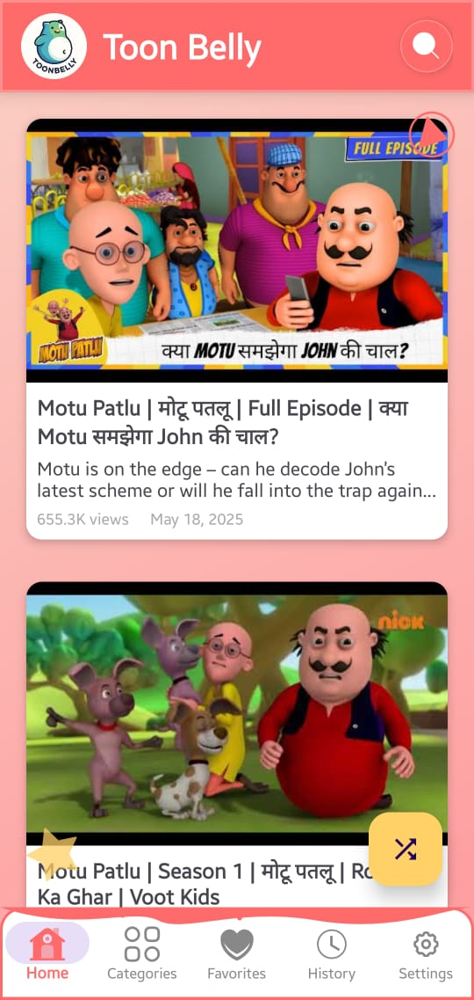
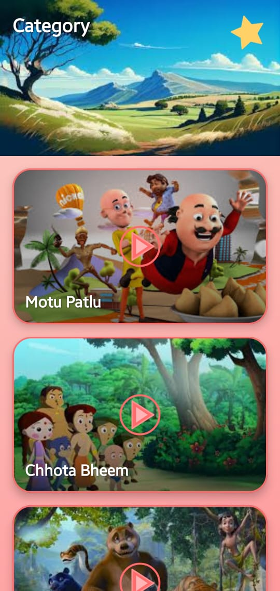
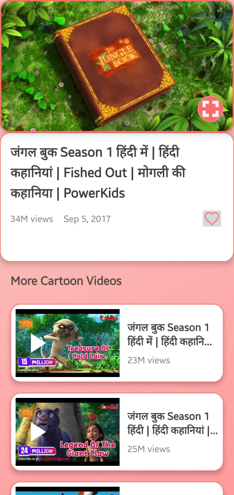

# 🎨 ToonBelly – Cartoon Streaming App  

  
  
  
  

---

## 📱 About ToonBelly  
**ToonBelly** is a fun and engaging **Android cartoon app** built using **Java**.  
The app provides a colorful and cartoonish UI with modern gradients, icons, and animations.  

✨ **Key Highlights:**  
- 🎬 Watch cartoons directly on the **Home Screen**  
- 📂 **Categories** available in the navigation drawer  
- 🔍 Powerful **search feature**  
- ▶️ Built-in **YouTube Player** for smooth video playback  
- 🕒 **Watch History** to continue where you left off  
- ⭐ Add cartoons to **Favorites**  
- 🌙 **Dark Mode** support  
- 🧹 **Clear Cache** option for better performance  
- 🎨 **Cartoonish Modern UI** with gradients and icons  

---

## 🚀 Features  

✅ **Cartoon Streaming** – Explore and watch your favorite cartoons  
✅ **Categories Navigation** – Discover by genre and category  
✅ **Favorites** – Save your favorite shows for later  
✅ **History** – Track what you have watched  
✅ **Dark Mode** – Switch to eye-friendly mode  
✅ **Modern Cartoon UI** – Gradients, icons, and animations  
✅ **Performance Optimized** – Lightweight with cache clearing  

---

## 📸 Screenshots  

  
  
  

---

## 🛠️ Tech Stack  

- **Language:** Java ☕  
- **Platform:** Android 📱  
- **Player:** YouTube Player API ▶️  
- **UI/UX:** Cartoonish theme with gradients, modern icons, and animations 🎨  
---

## 👨‍💻 Developer  

Designed & Developed by **[Hariom Soni](https://github.com/hariomsonihs)**  
✨ Brand: **Codevora Developer**  

📧 **Contact:** hariomsonihs@gmail.com  
🌐 **Portfolio:** [https://github.com/hariomsonihs](https://github.com/hariomsonihs)  

---

## ⭐ Contribute  

If you like this project, don’t forget to **star ⭐ the repository**.  
Contributions, issues, and feature requests are welcome!  

---

  Made with ❤️ by <b>Hariom Soni</b> | Codevora Developer  

